### XMLHttpRequest (XHR)
This is XML HTTP Request, it uses HTML 1.1 protocol and json to comunicate with servers it can be synchronous or asynchronous depending on false/true argument given when creating request.

#### Create Request Object
`var url = 'http://www.someserver.com/data.json';`

`var request = new XMLHttpRequest //Using XMLHttpRequest constructor to create object(instance of)`

setting **XMLHttpRequest** objekt method and url.
 
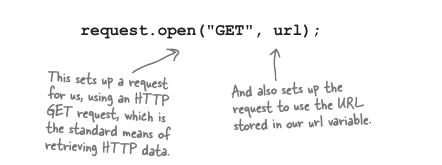

### Sending Request

Kad je sve podeseno sa `.open` moze se poslati request, imaj na umu da je ovo jos uvjek objekt.

`request.send(null)` - arg null je tu jer ne saljemo nikakve podatke. Nakon ovoga request je poslan.

### Primanje requesta
Server moze odgovoriti sa nekim od sledecis `.status` ili `.readyState`

#### Status
200 - The server has responded and all is ok
304 - Not modified
404 - Page not found
500 - Internal error on the server

### Event za primanje sadrzaja 

    request.onload(lv2) i request.onreadystatechange(lvl1)

Tipicno se postavi ***.onload*** property da se ceka kad se request loaduje, bez obzira u kakvom je stanju i da se postavi funkcija hendler na nju. Imaj na umu da je ovo lv2 XMLHttpRequest.

Starija verzija istog propertia je 

`request.readyState == 4`

a nova:

`request.status === 200`

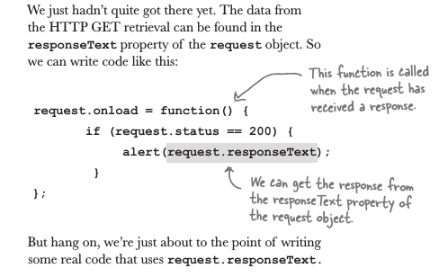

### Primanje sadrzaja

XMLHttpRequest ima property 

`.responseText`

gdje se nalazi povratna informacija u obliku JSON-a koji se nadalje treba parsovati sa `JSON.parse()` da bi se dobio javascript objekt.

### Cross-Domain limitacije

**XMLHttpRequest** ima jednu nezgodicu od strane browsera, implementirana u obliku 'browser policy' da blokira http request-a na druge domene.

recimo tvoj domen je *www.bigass.com* i trazis informacije sa *www.smallass.com* browser ce taj request blokirati zbog sigurnosnih razloga. Ono sto se radi u tome slucaju, u slucaju kad ti trebaju neki podatci sa drugih sajtova/domena, koristi se JSONP(javascript object notation with padding).

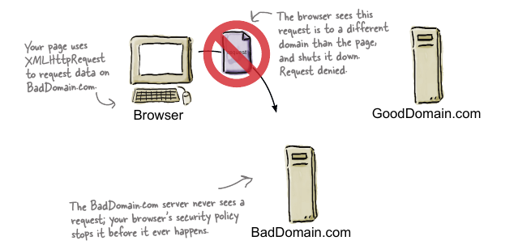
### JSON = JavaScript Object Notation
Saljemo podatke koji se vrlo lako mogu konvertovati u js objekt, ili javascript code, jer je code jako slican literalnoj notaciji javascript objekta.

Sintaxa Json-a:

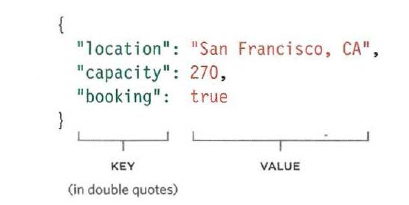

* JSON.stringify(); - Pretvara JS objekt u string formatiran u obliku JSON-a
* JSON.parse(); - Pretvara JSON Data u Js Objekt
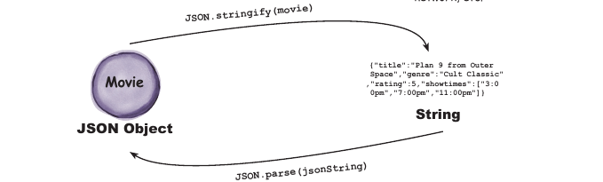

Prednosti:
*   Moze da se zove sa bilo koje domena(JSON-P/CORS)
*   Vise je koncizan(Manje verbosan) nego HTML/XML.
*   Uobicajno se koristi sa JavaScriptom i dobiva na popularnosti kod web app

Mane:
* Sintaxa je jako striktna, propusteni znaci navoda("), zarez(,) itd moze da 'polomi' fajl.
* Sobzirom da je to JS, treba biti pazljiv jer to je kod koji je 'live' moze biti opasan.Samo provjereni izvori.

### Replace Element
ovo je DOM metoda sluzi za zamjenu trenutnog elementa sa novim
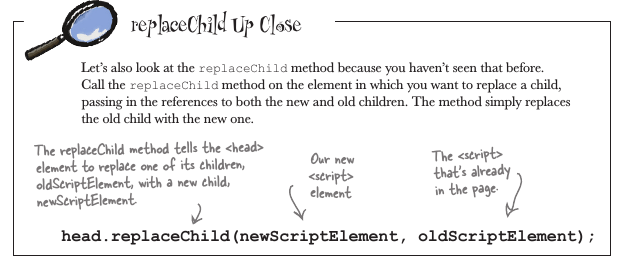

### Cross-domain limitacije workaround
*   Proxy File
    * Napravi fajl na svom serveru koji ce da skuplja podatke sa drugog(remote) servera koristeci neki od server side language kao sto je(php,ruby,NodeJS).  
   Svi zahtjevi sa tvoga sajta onda traze podatke od toga fajla sa koji je na tvome serveru, koji onda trazi podatke sa remote servera. Ide se preko middle-man-a ili ti proxy fajla. 

*   JSONP
*   CROSS-ORIGIN RESOURCE SHARING
    *Every time a browser and
server communicate, t hey
send information to each other
using HTTP headers. Cross-
Origin Resource Sharing or
CORS involves adding extra
information to the HTTP headers
to let t he browse r and server
know tha t they should be
communicating with each other

CORS is a W 3C speci fication,
but is only supported by the
most recent browsers and -
because it requires setting up of
HTTP headers on t he server - is
beyond the scope of this book.

### JSONP - JavaScript Object Notation with Padding
Mozes od ovome misliti kao JSON + callback ili "get me some json and execute it when you get it back"

U sustini to je nacin koji transportuje JSON objekte, koristeci ``

Koristeci jsonP browser sam uradi parsovanje podataka i interpretira ih u json objekt, i takodjer ih okruzi sa callbackom, koji mi sami navedemo kao parametar.

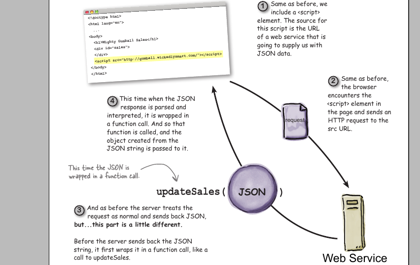

### Reimplementing JSONP

Problem nastaje onda kad nam treba da pozovemo jsonP pozive vise puta, a to sa `script` tagom zahtjeva manipulisanje DOM-a(Document Object Model-a). 

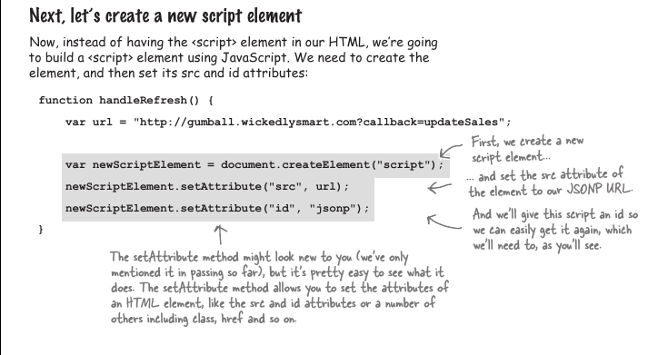

U principu za svaki poziv moramo stvoriti novi jsonP , tako sto ga kreiramo i zamjenimo u `head` tagu.

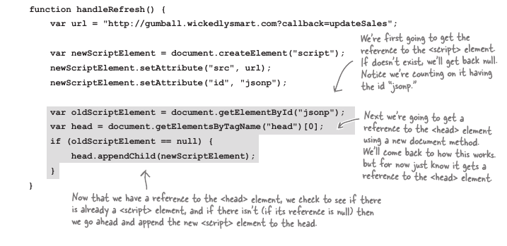

I na kraju, moramo ako zamjeniti postojeci ako ga ima sa kompletno novim script tagom, jer ako samo promjenis src kao atribut, sa `setAttribute()` browser nece napraviti novi poziv.

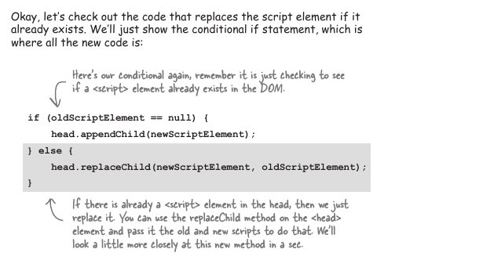

### Solving the Browser Catch Problem
Kad saljes mnogo poziva na odredjen url, browser catchuje tu web stranicu i stalno ti daje catch, da bi izbjegli to ponasanje, promjenimo url dodajuci rand num na kraju sa 'dummy' parametrom unutar URL-a koji ce server ignorisati.

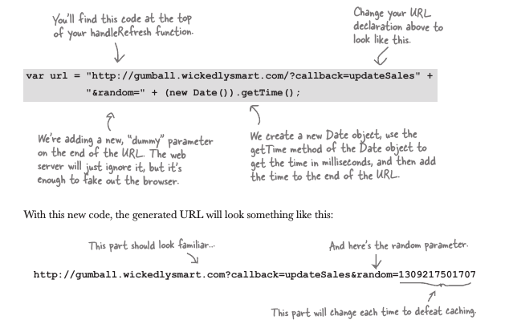
### Questions:

### Filtriraj Duplikate sa parametrom iz objekta

Uglavnom ovo je vise vezano za ovaj slucaj iz knjige nego za nesto specijalno, problem je nastao jer server daje sve rezultate na poziv, mi u samom kodu kad radimo poziv, odnosno kad stvaramo jsonP request, unutar url dodamo jos jedan parametar `lastreporttime` i sve to tako upakovano posaljemo serveru.

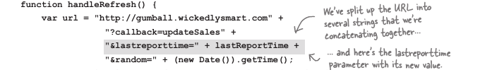

No medjutim taj parametar se mora stvoriti kao globalna variabila, inace nece raditi.

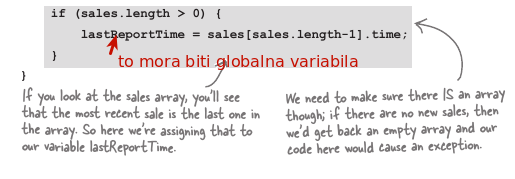

* How we get the data from the HTTP call
    tako sto koristimo ajax request new XMLHttpRequest
* What dose `.open` do?
    * Open pripremi xmlhttprequest na nacin koji zelimo da posaljemo nas zahtjev
* How do we create ajax object?
    * koristeci konstrakter funkciju new XMLHttpRequest
* How do we check is data we received is received or not?
    * koristeci lvl 1 metodu readyState ili lvl2 metodu 'status'
* What is number for notifiying us request is OK? lvl1 and lvl2 ajax?
    * 4 i 200
* Sta znaci asincronious? 
    * Znaci da se odredjen zadatak moze obavljati bez zavisnosti drugog ili u isto vreme, ne zaviseci od drugih.
* Kako request objekt zna da je asyncronous?
    * kad pripremamo objekt sa .open na kraju koristiti false(nije) (true) jeste `request.open('get',url,true) `
* what property to use to trigger the function, to do something with received data.(one word)
    * koristimo event onload ili onreadystatus, koji ce pozvati handler kad se ucitavanje zavrsi.
* How to send request to go and get the data?
    * request.send(null) -> null predstavlja da se ne salju nikakvi podatci
* Where is the data? How to access the data from the xhr object?
    `request.resposeText` 
* what is Json.
    * je tip podataka u obliku stringa formatirani na nacin da se mogu konvertovati u javascript object, sintaxa podsjeca na obj literal notaciju.
* How to send date with json
    * Moras koristiti metodu .stringify da posalje podatke, da konvertujes javascript obj u JSON
* How to get the data with json
    * Druga metoda JSON.parse(json)
* Can you get any other data type with xmlhttprequest other then xml? Which?
    * U principu bilo koji tip podataka od xml-a json-a html-a, response text ce drzati te podatke kod sebe.
* what is xmlhttprequest lvl 2?
    * lvl2 je trenutni standard koji se jos razvija, u sustini dodaju mu se nove metode i prokoli, implementiran od novijih browsera.
* Kako `<script>` element funkcionira?
    * script element pravi http request na src element i zaustavlja execution dok se taj resurs ne ucita.
* Sta je request objekt?
    * request object je xhm objekt sa kojim razmjenjujemo podatke/informacije sa serverom, uglavnom lokalnim.
* what is jsonp?
    *json with padding, u principu skup tehnologija koji sluze za ucitavanje resursa sa cross-domain, tako sto koristi argument callback u samoj adresi src koji je uglavnom naziv funkcije definisane lokalno, tako da je to json data zapakovan u funkciju i autokonvertovan u javascript.
* why Cross orgin request fail
    * Zbog browser policy koja ogranicava komunikaciju sa vanjskim(drugim) domenima
* How can you wrap your jsonp into function?
    * tako sto definises argument callback http://www.google.com&callback=jovo
* Why don't we change only 'src' atribute inside script tag?
    * jer browser tada ne napravi request, u pitanju je samo mjenjanje atributa.
* How to replace element in dom?
    * replaceChild?
* Sta znaci deserializing an object.
    * uobicajan naziv za parse metodu u JSON
* Sta znaci serializing objekt
    * pretvaranje u string .stringify
