### DOM (Document object Model)
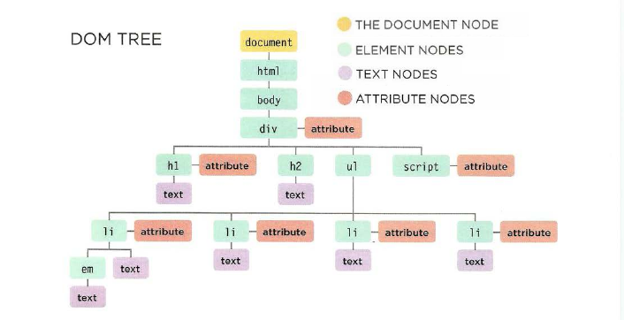

DOM je skup razlicitih tipova nodova(element node, text node, comment node itd.) koji reprezentiraju jednu web stranicu.

Vazno je shvatiti da su DOM manipulacije 'najskuplje' performance wise manipulaciju u js-u, od kojih NodeList se znacajno izdvaja jer je 'live'(ziva).

## Node sta je to? 310 PJWD
Je abstraktna reprezentacija individualnog dijela dokumenta. Svi drugi tipovi noda nasljedjuju od "Node".
Postoji 12 razlicitih tipova nodova, od kojih svaki ima svoj broj.
1. Element Node
2. Attribute Node
3. Text Node
4. CDATA Section Node
5. Entity Reference
6. Entity Node
7. Processing Instruction
8. Commenting NOde
9. Document Node
10. Document Type Node
11. Document Fragment
12. Notation Node
    

### TEXT NODES
Once you have accessed an element node, you
can then reach the text within t hat element. This is
stored in its own text node.
Text nodes cannot have children. If an element
contains text and another child element, the child
element is not a child of the text node but rat her
a child of the containing element. (See the `<em>`
element on the first `<l i >` item.) This illustrates how
the text node is always a new branch of the DOM
tree, and no further branches come off of it.

#### ELEMENT NODES
HTML elements describe the structure of an HTML
page. (The `<h l > - <h6>` elements describe what
parts are headings; the `
` tags indicate where
paragraphs of text start and finish; and so on.)
To access the DOM tree, you start by looking for
elements. Once you find the element you want, then
you can access its text and attribute nodes if you
want to. This is why you start by learning methods
that allow you to access element nodes, before
learning to access and alter text or attributes.

### Metode to access DOM elements -  overview

| Individual El| Multiple El           | Traversing |
| ------------- |:-------------:| -----:|
| getElementById()| getElementsByClassName() |parentNode |
| querySelector() | getElementsByTagName()      |previous/nextSibling |
| zebra stripes | querySelectorAll()     |firstChild/lastChild|

#### Node List()

Node list je vise elemenata koje dobijemu u 'array like' obliku(svaki node ima index broj), objekt koji se jos naziva i **collections**, koji ima svoje osobine(properties) i metode.

**Dvije vrste Node Liste:**
* Static(pocinju sa: querySelector) - somwhat slower but flexible
* Live(pocinju sa:   getElements)     - typicly faster

### Static node List
Nece updejtovati node listu u varijabili, odnosno broj nodova 

### Live node list
Updejtovace automatski nodelist, ako smo je sejvali u varijabilu i promjenili className, iz hot to cold, taj node vise nece postojati u live listi, to moze biti problem kad se loopuje kroz listu.

To izgleda ovako:
 
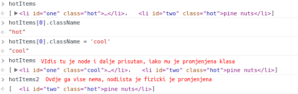

### Node List Like nodes

* HTMLCollections
* DOMTokenList - str 902 u TDG
    * To je node lista array like objekt koja u sebi sadrzi 'live' reprezentaciju elemenata iz DOM-a. Bitno je naglasiti da `DOMTokenList` ima svoje posebne funkcije koje ce ti olaksati zivot u buducnosti, misli o DOMTokenList kao poklon koji vjerovatno nisi zasluzio.

DOMTokenList Metode

| Metoda    | Opis           | return  |
| ----------|:-------------| -----:|
| .add      | dodaje na kraj ako nema token-a u listi | undefined |
| .remove   | izbaci iz Token Liste      |undefined|
| .contains | boolean ako postoji u listi      |true or false |
| .item | vrati token na osnovu indexa|token name string|
| .toggle   | dodaje/izbaci zavisnosti od toga da li je token u listi|ako ubaci(true) ako izbaci(false)|

### Pristupanje nodovima iz node liste
Dva nacina, bez obzira da li ima cak i samo jedan nod u listi, ako koristis metodu za vracanje nod list, uvjek dobijes nod listu taman da i je i samo jedan nod unutra.

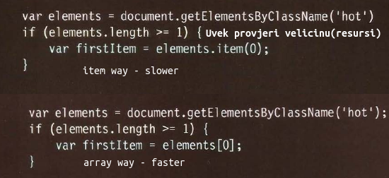

### querySelectorAll - special kind

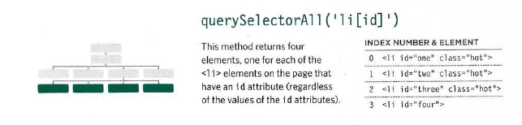
### White Space Nodes

### textContent vs InnerText
Oba propertisa ispljunu(vrate i povrate) vrijednost noda mez markupa, jedan moze biti bolji od drugog, ali preferira se textContent, najvise zbog nekih nedostaka **innerText**
#####textContent

cons:
* nije podzan price IE9

pros:
* Radi kako bi ocekivao, vrati vrijednost bez markupa, cisti tekst
* Ignorise 'hidden' i vrati cak i tu vrijednost.

##### innerText
cons:
* Firefox ne podrzava jer nije dio nikakvog standarda
* Takes in account layout rulse its slower.
* Nece prikazati nikakav content koji je sakriven od strane CSS-a

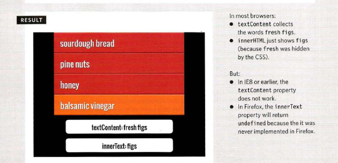

### Dodavanje i Brisanje HTML-a u DOMu

Dva nacina za dodavanje sadrzaja u DOM-u `innerHTML` i DOM manipulacija.

#####InnerHTML

innerHTML ima potencijalne security issues vezane za cross-domain-attacks, vise o ovome poslje.

Adding and removing content

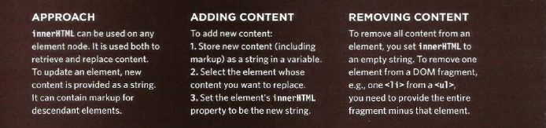

#### Pristupanje i azuriranje sadrzaja sa innerHTML
innerHTML vrati natrag dugacki string od html-a ukljucujucu i bilo koji markup i sve u row varijanti.
Ako se koristi za dodavanje novog contenta mora se koristiti manipulisanje sa stringom i njegovim metodama.

Ovo moze biti problematicno jer ako prospustis jednu zagradu cjeli dizajn moze biti sjebantikus. Takodjer ako se ova metoda koristi da se dopusti korisnicima da dodaju sadrzaj mogu vrlo lako ubaciti maligan kod.

Prakticno to izgleda ovako:

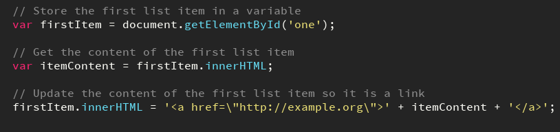

### DOM Manipulacija

DOM manipulacija mnogo bolje targetuje individualne nodove gdje innerHTML bolje edituje vece frakcije koda.
Takodjer dom manipulacija je sigurnija od **innerHTML** ali moze biti sporija i zahtijeva vise koda.

Premisa:
Je ta da koristeci DOM metode mozemo stvarati elemente i tekstualne nodove, te ih dodavati ili uklanjati sa DOM tree-a.

Dodavanje:
Koristeci jednu metodu da prvo stvorimo element, i zatij jos jednu metodu da ju dodamo u DOM.

Remove:
Takodjer koristeci neku od dom metoda mozes da uklonis element ukljucujuci i child elemente.

To otrpilike izgleda ovako

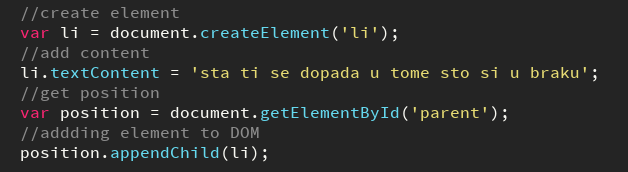

`Napomena: postoji jos jedna meotda za dodavanje elementa u dom, vrlo korisna insertBefore();`

### Remove El from DOM

U 2 koraka: (ili manje);

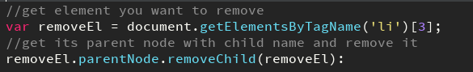

Nova metoda je dodana upravo da sredi ovaj 'hak' i vrlo ima smisla.
`removeEL.remove();`

### Pros and Cons 

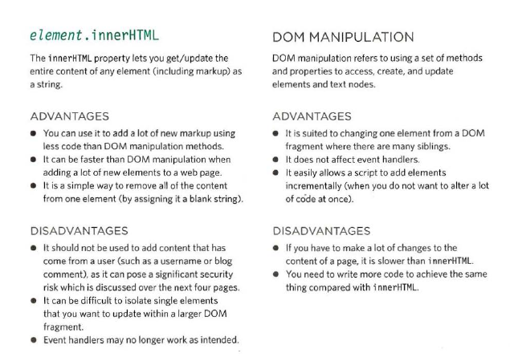

## Dealing with users input(escape)

Sav content koji dolazi od korisnika treba biti 'escaped' na serveru prije nego sto se prikaze u browseru.

#### Adding user content:
Bez obzira sto je izbjegnut na serveru treba ga dodati kao tekst koristeci
* textContent
* innerText
NE KORISTI **innerHTML** za dodavanje korisnickog sadrzaja.

##### Escaping shit

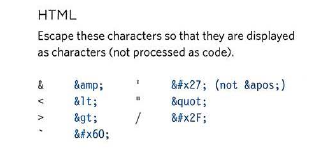

## Attribute NODES

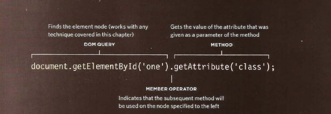

#### Metode:

| Metoda      | What it dose|
| ------------- |:-------------| -----:|
|getAttribute() | gets array of attributes you specify (1arg)| 
|setAttribute() | sets attribute(2 arg)                       | 
|hasAttribute() | return true/false to atribute you set(1 arg)|
|removeAttribute()|removes attribute from element node(1 arg) |
|classList|Vrati DOMTokenList gdje je svaka class token|

| Property      | What it dose  | Cool  |
| ------------- |:-------------:| :-----|
| className     | gets/sets value class attribute   | el.className = 'first' |
| id            | gets/sets value id attribute      |   el.id = 'unique' |

Jos neki dodatni property:
* checked, accessKey, href, lang, title         

Check to see if there is any then get attribute

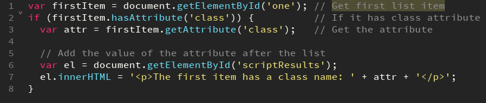

#### Create and change attribute

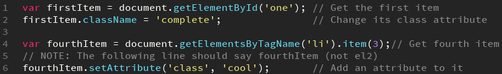

#### Remove Attribute

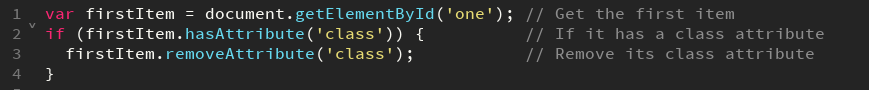

### Add before

* newItem -> element we just created
* target  -> its sibling, newItem will be insert above him(before)

`parent.insertBefore(newltem, target);`

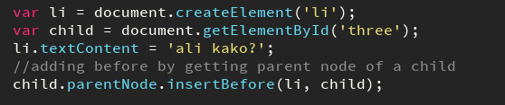
