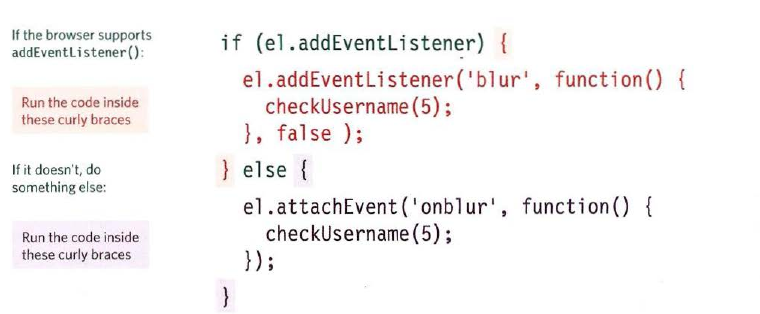

## Event Tipovi i lista
U globalu postoje nekoliko vrsta eventa koje se desavaju prlikom interakcije ili uzrokovane interakcijom korisnika.
* UI Eventi
* Mouse Eventi
* Keyboard eventi
I nekoliko koji se desavaju uzrokovane ostalim stvarima:
* DOMSUBTREEMODIFIED
* DOMNodeInserted
* DOMNodeInsertedIntoDocument
* DOMNodeRemovedFromDocument

#### UI EVenti
* load      : Page loads
* unload    : Tipically browser navigates out of that web page 
* error     : Error is raised
* scroll    : User has scroll up/down on the page
* resize    : Browser window has been resized.

#### Mouse Event
* **click**
* **dbclic**
* **mousedow**
* **mouseup**
* **mouseover**
* **mousemove**
* **mouseout**

#### Keyboard Events
* keydown** : Korisnik pritisne tipku(ponavlja se sve dok je tipka pritisnuta)
* keyup**   : Korisnik pusti tipku.
* keypress**: Jedan karakter se unosi(ponavalja se ako je dugme pritisnuto)

####Focus Eventi
* focus / focusin   : Element dobije fokus
* blur / focusout   : Element gubi fokus

#### Form Eventi
* **input**  : Vrijednost u `input` ili `textarea` se promjeni(IE9+) se promjeni ili bilo koji element ciji se sadrzaj moze promjeniti, se promjeni
* **change**  : Vrijednost u 'checkbox', 'value box', 'radio button', se promjeni
* **reset**
* **cut**  : Korisnik 'cutuje' nesto iz form fielda
* **cop**  : Korisnik 'kopira' nesto iz form fielda
* **paste**
* **select**  : Korisnik selektuje tekstu unutar form fielda
#### Mutation Eveni
* DOMSubtreeModified        : Promjene su se desile u dokumentu
* DOMNodeInserted           : Node je ubacen kao direktno dijete ili drugacije.
* DOMNodeRemoved            : Node uklonjen iz drugog noda
* DOMNodeInsertedIntoDocument: Node ubacen kao potomak drugog noda
* DOMNodeRemovedFromDocument : Node je uklonjen kao potomak drugog noda

### Event Handeling

Je 'proces' sa kojim se 'trigger' kod koji je zasluzan da se pozabavi situacijom koja je nastala. Da li je to, kad korisnik klikne na element, ili upise nesto u input. Moram ti samo napomenuti da je malkice drugacije kad su u pitanju UI eventi.

1. Get Reference to elem
2. Bind event to trigger the code
3. Napisi/Uputi na kod koji zelis da se pokrene kad se event desi

### 3 Tipa Event Handlanja

1. HTML EH Atributi - NEMOJ KORISTITI 
2. Tradicionalni DOM EH

**(vise na strani 262 Dukett)**
3. Event Listeners -> Moderni nacin, (IE9+) podrzava vise funkcija odjednom, odnosno na jednom elementu.

Uglavnom je sve jasno osim, booleana koji indikuje kako event putuje(event flow).

### Podrzavanje Parametar + Older Browsera

Anonimna funkcija koja u sebi ima pravi event handeler koji moze primiti argument.Ili elokventnije receno, **anonimna funkcija** koja u sebi ima function declaration
koja prima argument.

## Event Flow
Dvije vrste event flow-a:
* **Event Bubling**
    * Ide od najspecifiranijeg do document noda **flow outwords**

    `el.addeventlistner('click',someFunc,false);` 

* **Event Capturing**
    * Ide od document noda, do najspecifiranijeg noda, **flow inwords**.

    `el.addeventlistner('click',someFunc,true);` 

**false** ovdje znaci da element flow ce biti **bubling** `a>li>ul>div>body>document` 

**true**  ovdje znaci el flow ce biti **capturing** `a<li<ul<div<body<document`
#### Zasto je Vazan Event Flow
Jedino je vazan kad imas vise eventa hendlera na potomcima(`a li ul div`), jako je bitno znati kad ce koji handler okinuti, a upravo to odlucuje **true/false** koje naznacimo.
U principu ja to zamisljam kao lift, kad je false lift ide sa prvog sprata prema gore, a kad je true lift se spusta odozgo pre dole(capturing svaki sprat)
##Event Object:

Je prisutan uvjek, ali da bi ga pozvali/vidjeli/manipulisali mora se definisati parametar unutar event handlera, koji se poslje koristi kao localna varijabila. 
Kad god se desi neki event, **event objekt** ti daje informacije o tome eventu, kao i na kojem se elementu desio.
 | Properties       | I5-I8         | what it dose  |
 | ------------- |:-------------:| :----|
 | target           | srcElement    |Ovo je target, sam element(najspecificniji element sa kojim se radi interakcija) |
 | type             | type          |tip eventa koje je okinuo|
 | canceble         | not supported |Mozes li otkazati uobicajno ponasanje elementa|
 | PreventDefault() | returnValue   |Otkaze defaultno ponasanje eventa, ako je to moguce|
 | stopPropagation()| cancelBubble  |Zaustavlja event od nastavka 'bubblinga' ili capturinga dalje|
### Event Listner bez parametara

 

 Zanimljiva stvar je da ti ne trebas definisati parametar, jer je on vec dostupan, samo mu trebas dati ime u argumentima koje je uglavnom **e**. e je referenca na event objekt.

### Event Listner sa parametrima

 

### Listner i Event Obj Skupa

Jako fleksibilna funkcija koja ustanovi koliko input ima karaktera i na osnovu argumenata postavljenih upise, u sledeci sibling poruku.
U principu ovoj funkciji treba jos jedan prazni element diretno ispod.

SCREEN                                      PAGE
screenX i ScreenY znace pozicije            pageX and pageY znaci koordinate    
cjelog ekrana, fizick monitora              od pocetka cijele stranice, top 
                                            moze biti izvan viewporta ali  
CLIENT:
clientX i ClientY samo znaci ono sto korisnik vidi u svom viewportu.
## Event Delegation

Mnogo event listnera na svakom elementu moze usporiti stranicu, tako da je mnogo pametnija strategija koristeci event flow postaviti jedan na parant element, i na osnovu target property-a odluciti dalje. 

##Events in IE8

Naravno decki iz MShita seru pa ako hoces da ti js radi i u starijim browserima, obrati paznu:

1. Vecina 'on' propertiesa nije podrzana od verzije IE9: Ovo su html properties btw. kojima mozes attach handler.

    * onload
    * onclick
    * onfocus
    * etc..

2. Takodjer ne mozes niti koristiti standar za dodavanja `addEventListner()` vec `attachedEvent()`

Ovo ti nije tako tesko izbjeci uz jednostavan if statment:

3. Kad je event ***'pokrenut'(okinuo)*** i tvoj event handler funkcija je pozvana, umjesto da preda event obj handler funkciji, retardirani IE8 i stariji spase event obj u window obj. ` window.event`

  

