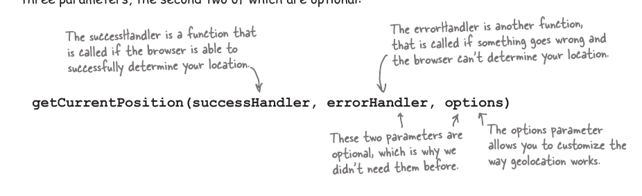
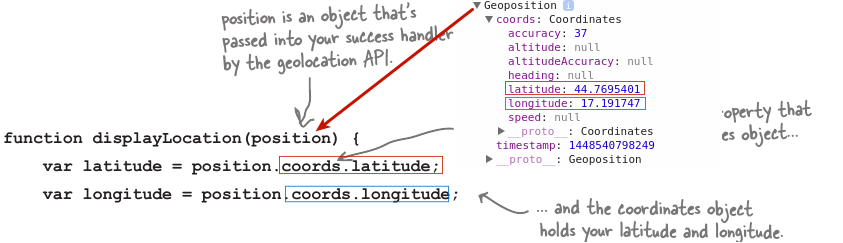
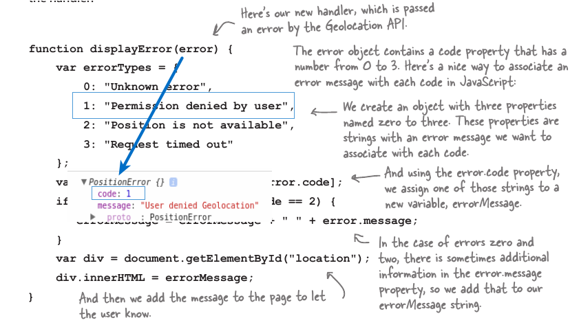
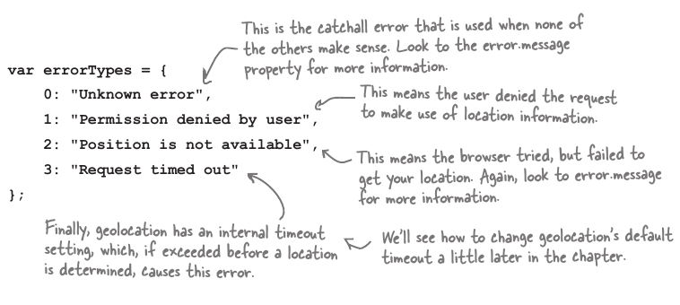

### Short Shit About Location

Geolocation(navigator.geolocation) ima samo tri metode:
    * .getCurrentPosition
    * .watcchPosition
    * .clearWatch

Geolocation is real API in JS, user must explicitally allow to share it's location, GL is not first class member in JS, its very well supported.


Osnove Geolokacije:

***Latitude***(Geografska sirina): Od Ekvatora Sjeverno i Juzno<br>
***Longitude***(Geografska Duzina): Istocno i Zapadno od Greenwitch England

U geolokaciji se koriste 2 formata:
* decimalni oblik:  (47.64, -122.54)
* Stepen/Minuta/Sekunda oblik:47 ̊38’34’’, 122 ̊32’32’’

U js GL mi koristimo decimalni oblik.

## Kako se odredjuje Lokacije - Ne samo GPS!

Bez obzira sto ti mislis na spomen geo lokacij GPS, postoji jos nekoliko nacina kako odrediti gdje se nalazi uredjaj.

* IP
* Cell Phone
* WiFi
* GPS

#### Ip addressa
IP adressa je relativno globalna za odredjivanje geolokacije, mogu reci cak i ne precizna, i uglavnom odredjuje lokaciju na sirem geo teritoriju kao sto je GRAD/Drzava.

#### Cell Phone
Bez obzira ako telefon nema ugradjen GPS (Ili je ugasen) sa trijangulacijom Repetitora na koje je tel povezan, moze se ustanoviti njegova lokacija, manje ili vise pouzdano. Ako je povezan na jedan repetitor lociranje ce biti nepreciznije za razliku ako je povezan na vise. U ovome sl. > je bolje. Radi gdje god ima 'mobilnog signala'. Mnogo brze nego GPS.

#### GPS
Global Position System, jako precizan, tezak na bateriju i uredjaj mora imati vidljivost neba da bi se konekcija uspostavila, takodjer moze potrajati malo duze za ustanovljavanje pozicije.

#### WiFi
Ovaj metod zahtjeva jedan ili vise poznatih wif 'hot spots' da uredjaj bude povezan na, da bi odredio lokaciju, jako je pouzdan, tacan , brz i radi unutar prostorija kao i "Mobilini Signal" Zahtjeva se da uredjaj ne bude mobilan, u smislu da bude statican, recimo povezan na wifi u nekom kaficu.


#### Ko odlucuje kako se odredjuje lokacija

Odlucuje browser, u ovom slucaju korisnik nema pojma koji mehanizam se koristi za ustanovljivanje lokacije, nakon sto odobri da se moze uraditi geolokacija. Pametni browseri uglavnom koriste prvo "mobilni signal" za odrediti lokaciju ugrubo, pa onda nesto precizniju kao sto je GPS ili wifi da se utvrdi tacnije gdje se uredjaj nalazi.

### Navigator.geolocation
navigator.geolocaiton je objekt koji u sebi sadrzi svojstva i metode, sve sto trebas za rad sa geolokacijom API's, dobra ideja je koristi konditional da se ustanovi da li browser podrzava geolocation API odnocno da li ima navigator.geolocation pa onda pozivati metodu getCurrentPosition.

#### getCurrentPosition();
To je metoda koja u sebi sadrzi lokaciju, ali se mora kao argument pustiti handler, koje ce je izvuci, Opciono: sa jos dva argumenta.



#### .watchPosition

Skoro indenticna kao i getCurentPosition() samo sto u pozadini stalno cekat promjenu pozicije i 'zove' 'successsHandler'.

#### successHandler 
u sebi mora imati jedan argument koji je zapravo position objekt iz kojeg onda izvucemo latitude i longitude.
Position objekat je dio API'a i ne treba se zvati tacno position, mora biti prisutan jer u sebi sadrzi lat i long.

### Accurecy 

Unutar Position objektu imaju nekoliko propertisa koje drze jos objekata, zanimljv je 'coords.accuracy' koja izrazava tacnost lokacije u metrima, radijusu udaljenosti. Recimo ako accuracy 500: znaci da se uredjaj nalazi oko 500 metara u radijusu od stvarne lokacije sa 95% sigurnosti tvrdi.



#### errorHandler (displayError)
    getCurrentPosition(displayLocation, displayError);

This is the second argument, and its optional. To je funkcija (handler) koja ce biti pozvana ako se desi neka greska prilikom dobivanja pozicije. Recimo Nema konekcije, request time out itd. Ta funkcija ima vec ugradjen parametar od strane Geolocation API-a koji je ustvari PositionError objekt, u sebi sadrzi par svojstava(property)


### Error Types from argument PositionError


#### options (third argument to getCurentPosition)

Its an object, cini se je trend u geolocation, da su svi argumenti za opcije, objekti.

``enableHighAccuracy: false,```

uobicajna opcija je 'false' kad je ukljucena mi govorimo api'u da nam treba najtacnija moguca lokacija koju on moze u tome momentu ustanoviti, bez obzira koliko je energetski skupa. To ne znaci da browser moze da pruzi 'jos tacniju' lokaciju nego uobicajano.

`` timeout: Infinity,```
Ova opcija govori browseru koliko DUGO si moze uzeti da ustanovi lokaciju od korisnika. Treba imati na umu da ako browsr bude pitan da li da dozvoli koriscenje lokacije, da timeout krece onda kad user odobri, ne prije. Ako browser ne moze to uciniti(naci lokaciju u zadanom vremenu) error handler se zove.

``maximumAge: 0,```

Ova opcija govori browseru koliko stara moze biti lokacija. 
Ustvari ovo je neki vid 'catcha', recimo da je getCurentLocation pozvan prije 60sek a maximumAge podesen na 90000 milisekundi, bez obzira sto je metoda getCurentLocation pozvana opet dobili bi istu lokaciju, browser ne bi pokusao dobiti novu lokaciju. 

Da je maximumAge podesen na 30sek, getCurentLocation bi bio obavezan da ponovo pokusa dobiti lokaciju.


### map.PanTo(latLng) ovo je google metoda i google objekt od coordinata

PanTo meotda od mape uzima LatLng objekt(googlove) i skroluje mapu tako da nova lokacija bude u centru mape.

Q: Can we controlle the speed of how often brower offer update on location?
A: Nope, browser decides on its own!


