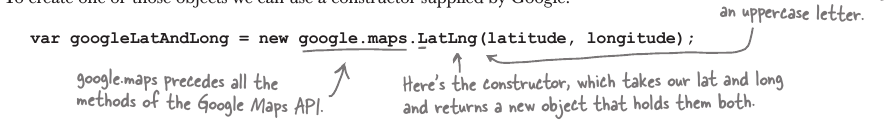
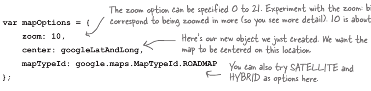
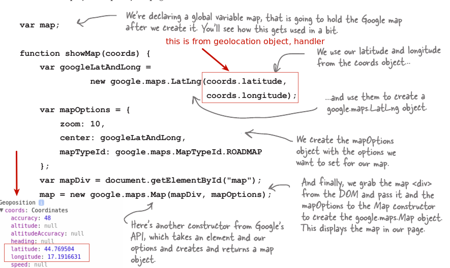

### Google API

Goog map API radi u sibmiozi sa Geolocation api, prvi korak je ubaciti api unutar aplikacije/html stranice.

    <script src="http://maps.google.com/maps/api/js">
    ?sensor=true -> nije vise potrebno, inace je sluzilo da se naznaci koriscenje, vlastitih koordinata.
    
***google.maps*** -> This is the actuall API object, everything form ther we have access tol
    

### Google map object



### Map Options:
Neke stvari u mapi mozemo kontrolirati, kao sto je gdje je zoomirana mapa, koji tip mape se prikazuje i gdje je centrirana. Map options je objekt literal.



### Show Map (function to show up map)



### Stvaranje mape

Jednostavan statment je da bi se stvorila mapa.
* Step0: Mora se uzeti pozicija gdje je mapa, i to se dati konstruktoru kao prvi argument.
* Step1: Mora se stvoriti novi objekt koristeci LatLng konstruktor da se 'spoje koordinate'
* Step2: Mora se napraviti MapOptions obj sa 3 properisa, jedan od kojih je LatLng obj kao ```center```
tamo gdje se centrira mapa.
* Step3: map = new google.maps.Map(mapDiv, mapOptions);
Step 1: map = new google.maps.Map(mapDiv, mapOptions);

