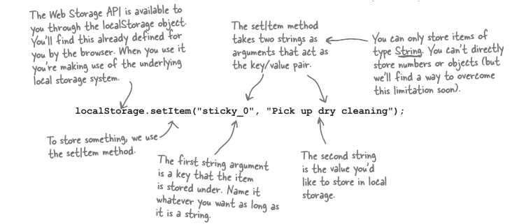

LocalStorage je baza 'storage' u tvome browseru i API koji mozes koristiti za cuvanje podataka.

Takodjer LS je jedan od bolje podrzanih API-sa u HTML5 i vrlo je jednostavan za koristiti.

U principu koristi ***key/value*** sistem za upis u bazu, slicno kao JS objekt. Direktno se moze sacuvati podatak samo u obliku STRINGA. Array i objekt koriste JSON (parse & stringify)za cuvanje unutar lokalne baze.

### Dodavanje item-a u bazu.

`localStorage.setItem("name","Marko");`
*   ***key -> "name"*** 
*   ***value -> "Marko"*** 

### Uzimanje iz Baze

`localStorage.getItem(key);` 
To je to, i na kraju dobijemo vrijednost iz baze. To su u principu dvije glavne metode.

##### Array Like LocalStore
Mozemo dodavati item's u bazu koristeci i klasicnu 'indexed' based sintaxtu array, kao i removati array elemente, odnosno elemente iz LocalStoraga koristeci nekoliko array like metoda.

**Gets Item from LocalStorage**

Zanimljivost i puna moc ove tehnike(array like) dolazi kad se kombinira sa 

`.key()  i .length()` metodama koje pretvore to prebacivanje i dobacivanje doslovno u array.

### Brisanje
Dva nacina brisanja, pojedinacno i ciscenje cjele baze.

* localStorage.removeItem(key) - izbrise taj item sa tim kljucem
* localStorage.clear(); - izbrise cjelu bazu
### Cuvanje drugih Tipova Podataka:

localStorage moze cuvati samo string podatka u svojoj `value` paru, ali to ne znaci da mi ne mozemo konvertovati Tipove podataka u string, i iz stringa.

Brojevi, float, Array, objekti.

##### Brojevi.

kljucna metoda je `.parseInt(num);

##### Floating Point brojevi

metoda koja se koristi je `.parseFloat(num)`

##### Array i objekti - Power of JSON

Ovdje nema iznanadjenja nakon sto sam naucio JSON, u sustini JSON je ustvari string koji je formatiran u  JSON formatu key/value i : i i zarezom(,).

Da bi sejvali nesto u localStorage sto je objekt ili Array moramo to pretvoriti u string sa JSON metodom

* JSON.stringify(obj); 

### Nevjerovatna stvar za vreme u unixu

1 milisekunda je 1000ti dio sekunde, to je jasno ono sto je malo iznenadjujuce je da metoda .getTime() vrati broj milisekundi od 1970e, to je nasljedjeno od unix like sistema.

`var date = new Date();`
`var time = date.getTime();`
`var key = 'sticky_' + time;`

vreme prije 1970 se predstavlja u negativnom broju.

### Key Ordering

Redosljed nije definisan, ovo je ostavljeno browserima na izbor tako da se ne smijes uzdati u 'ordering' . Iako loopujuci kroz cjlu bazu ces dobiti sve key's. 

### Podrzavanje API-a

Ista stvar se desava i kad hocemo da sejvujemo i objekt u bazu, moramo ga `.stringify()` i da ga ozivimo moramo ga iz baze `.parse()`.

Upravlje prema orginu koji je ustvari domen, npr svaka stranica sa facebook.com moze vidjeti svaki item od svog domena u local storageu, ali niti jedan drugi domen ne moze vidjeti te itemse.

*   facebook.com -> Moze pristupiti samo svome localnomStorage-u
*   google.com -> Ne moze pristupiti localStorage-u od facebook-a.

Vec sam spomenuo da je jako podrzan od svih znacajnih browsera, iako se moze provjeriti da browser koji korisnik koristi ima mogucnost koriscenja LS tako sto se zove taj objekt        

Kolicina podataka koju browseri dozvoljavaju se mjeri prema domenu, i uglavnom je oko 5-10megabajta. Naglasavam po domenu, recimo facebook.com(5mb),twiter.com(5mb), itd.

QUOTA_EXCEEDED_ERR je greska koju browser posalje kad nestane prostora, kad se onaj prostor od 5-10mega istrosi.

#### SessionStorage - the last thing

Pored LocalStorage api-a imamo jos i jednu super stvarcicu i njegovu sestricu 'sessionStorage' sve je isto kao i sa localStorage osim sto svaki put kad se browser resetuje, sessionStorage izbrise sve podatke automatski iz svoje baze.

`if(localStorage) { alert('yay its a live')}`

### Neke ideje za LocalStorage i SS
*   Catch twiter search results for efficency.
    * When users search, first check localStorage
*   Storing playlists with metadata for users.
    * Store their fav clips along time code where they leftoff viewing

*   SessionStorage for new ecommerce libary's shopping cart. 
    * When users close browser shopping cart go bye bye.
    
*   Synchronize state for games inbetween browsers.
*   Speed up mobile devices by storing local data on device.
*   Store user state localy as oppose to before when we needed server side programing stored sesions.
