## Kako `<video>` element radi
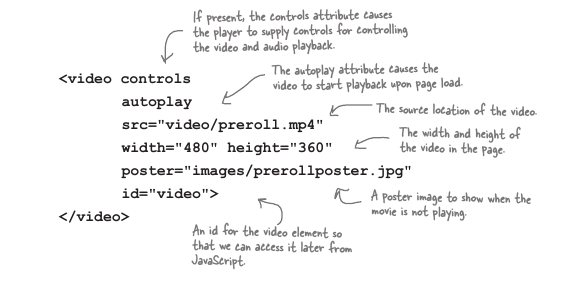

* Controls
    * To je boolian, ako je prisutan kontrole ce biti vidljive, i obrnuto.
    * Zavisno od browsera izgledace drugacije
* autoplay 
    * ocigledno, isto boolian ali me je kostao 'trzanja' vise nego bilo koji drugi atribut ikad.
    * boolian
* poster 
    * Ovdje ima nekih zackoljica, u principu zanimljiv atribut. Kad autoplay nije prisutan, browser ce prikazati sliku(tipicno prvi frejm, koji je vrlo cesto crn) prije nego sto kliknes 'play' ili sliku koja je definisana u ovome atributu u src atributu.
    
    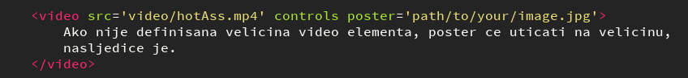

    * Ovdje se definise slika koju hoces ako ne zelis da browser bira za tebe prvi frejm.
Prilicno je sve logicno osim 'poster' atributa. Poster slika se ukljuci kad se stisne pauza na kontrolama.

* preload 
    * boolian tipicno se koristi za optimizaciju kako se video downloaduje prije nego sto korisnik klikne na 'play', u sustini to odlucijue browser prema faktorima kao npr da li je autoplay prisutan i prema korisnickom bandwidthu. Ovo ponasanje se moze iskljuciti sa `preload='none'` (nisam testirao), samo ce se meta data skinuti sam video se nece poceti skidati do momenta dok user ne klikne play.
    
* loop
    * jos jedan boolian, loop ponovo pokrece video od pocetka.

* width, height 
    * ovo takodjer utice i na poster, poster slika ce biti matchovana na osnovu ovoga atributa.
    * Video ce biti skejlovan, ali ce zadrzati aspect ratio(4:3,16:9) sta god to znacilo.
    * ako bude nekog prostora gore, ili sa strana video ce biti ***pilar-boxed*** ili ***letter-boxed*** unutar display area size.
    * ovdje podesavamo display area, takodjer se zove i 'viewport'
    
## Video Formats

U sustini zanimljiva tema, video se sastoji od nekoliko razlicitih elemenata, spomenicu nekoliko popularnih u svjetu web-a:
    * Video enkodinga(H.264,Theora,Vp8, vp9)
    * Audio encodinga(AAC,Vorbis)
    * Kontejnera(WebM,Mp4,Ogg(ogv ekstenzija))

Encoding je dio koji smanjuje velicinu i omogucava da se video pusta efektivnije, i tu su uglavnom nesuglasice, izmedju browser 'firmi'.

Uglavnom sere Safari koji ne podrzava nista osim H.264/mp4, ostalo se mora manuelno instalirati plugin.

### `<source>` element unutar `<video>`

Ok, znaci naucio si da ima nekoliko vrsta video i audio enkodiranih formata kontejnera i audio enkodera koji se koriste 'around the web' danas uglavnom su svi podrzani, ali recimo za optimiziraniji osjecaj da browser izabere koji hoce da pusti, mozemo koristiti `<source>` element, ne `src` atribut.

Ovako se koristi:

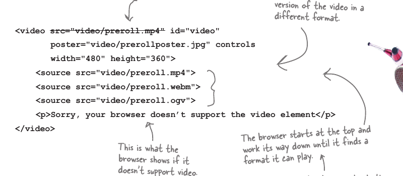

Krece odozgo i pregledava metadata od svakog videa, te ustanovi da li moze da ga pusti. Nekad zna biti malo duzi proces, narocito ako je video veci, ovo mozes olaksati ako specificiras metadata sam.

## Kako olaksati broweru
Vec sam to spomenuo a to je na nacin da mu sami vec napisemo metadata(bazicne inf, codec, container)
type='video/ogg; codecs="theora,vorbis"'
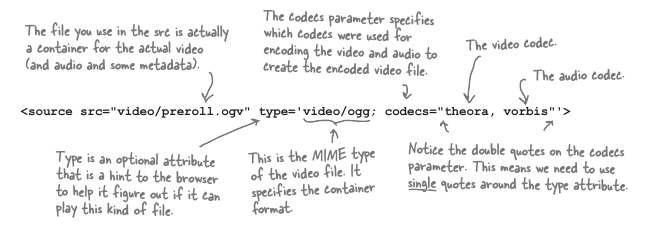;

Da ponovim, MIME tip je nista drugo nego data format i container format.

## Video Volumen

Ovo je properti(osobina) koju podesavamo kad dobijemo referencu na video.
    `video.volume = 0.9;` 
0.0 je minimalno, 1.0 je najglasniji.

## Flash Video
Za flash video zaduzen je element ``<object></object>`` u koji se embeduje flash.

# Video API's

Ovo je do sada bilo onako elementarne stvari koje su se ticale video formata kao i elemenata. Kako kontrolisati video play sljedi dalje, odgovor je Api's koji nam to dozvoljavaju.

## Properties Methodes and Events:
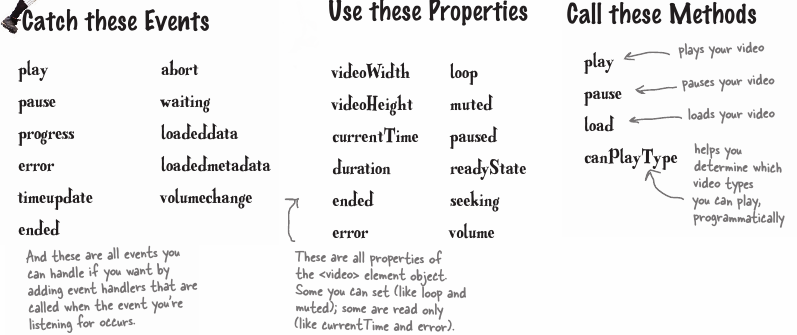

### canPlayType Metoda

Koristimo je da ustanovimo da li browser moze da pusti taj video, kao argument koristimo metadata.
ako koristimo samo MIME(tip conteiner) necmo dobiti vise nego 'maybe'.

Uglavnom, `canPlayType`  ti vrati **3 vrijednosti** natrag preme koliko je siguran da moze pustiti video;

#### 3 Vrijednosti: 
`video.canPlayType(video/ogg);`
    * ''            ne moze pustiti
    * 'maybe'       Vrlo vjerovatno moze
    * 'probably'    Jako je siguran da moze
Takodjer je vazno za shvatiti da browser nece vratiti vise od **'maybe'** ako mu se ne pusti vise informacija kao argument u canPlayType.

`video.canPlayType('video/ogg; codecs=theora,vorbis"')`

Ovaj kod ima potencijal da vrati vrijednost **'probably'** jer smo dali dovoljno informacija o videu da browser moze ustanoviti sa vecom sigurnosti da li moze pustiti video.

## Procesuiranje videa
Ako hoces da procesuiras video, smanjis velicnu, pustis dva odjednom preko neke posebne preklopne elemente moras koristiti Canvas.

Sa canvas + video mozes procesuirati video in 'real time', js je postao toliko brz jezik da to moze uraditi, iako ne dovoljno precizno koliko bi zelio(setTimeout):    
* Inspect videos characteristics
* Grab data from video frames
* Rotating/scaling 
* changing pixels

Mene licno za jedan projet zanima stavljanje subtitlova na video, kao i pravljenje mojih modernih subtitlova. THINK big preko ekrana, u raznim pozicijama(vertikalno i horizontalno), ono sto se prije radilo u nekom video edit programu.

### Boje u Videu

Poput ostalih stvari u web developmentu RBG standard, 3 boje, zapravo 4 ako racunomo Alfa.

## Kako video obrada radi u browseru
Tako sto manipulisemo sa pixelima u kanvasu, moramo uraditi transfer, jer video ne mozemo obradjivati direktno, taj transfer se desava kroz kanvas koji sluzi kao 'pecnica', obradi proizvod i izbaci drugaciji, vrlo cesto bolji oblik, ta 'pecnica' se jos naziva i **'Scratch Buffer'**.

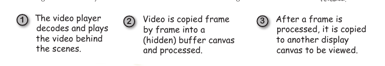

U principu uzimamo svaki video frejm i mjenjamo sve pixele u njemu u pozadini, i onda ga opet prikazujemo korisniku.

### Scratch Buffer

Je metoda koja koristi dva kanvasa koja dokazano koristi minimalno resursa prilikom intenzivnog obradjivanja slike i vide-a da bi se sprecilo vizualni bugovi. Kljucna rijec je minimize visual glitches(dobro 3 rijeci), uzimamo video frejm kopiramo ga u canvas 1 obradimo i prikazemo na canvas 2.

1. Browser dekodira video u seriju frejmova.
    * ***video frejm*** je skupina pixela u kvadratu u datom vremenskom periodu, schreen shot if you will.
2. Kako se koji frejm dekodira odma se kopira u canvas na obradu koji se naziva scratch buffer.
3. U scratch buffer-u mi radimo iteraciju preko svakog pixela i dajemo ga nasoj funkciji koja ce promjeniti boju, ili odraditi neku drugu manipulaciju.
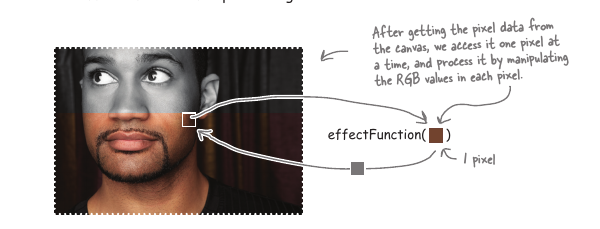
4. Kad su svi pikseli u scratch buffer-u procesuirani onda ih kopiramo(taj cjeli frejm) iz scratch buffer-a u canvas koji mozemo vidjeti.
5. To radimo (korake od 2-4) na svaki frejm koji dobijemo od video objekta.

## Creating Scratch Buffer

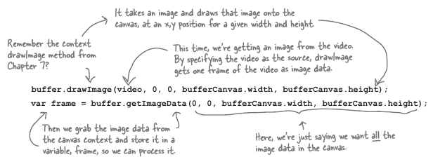

Ovdje ima mnogo abstrakcije kad dodamo **video** objekt, koji ustvari kao argument je slika, jedan frejm. I to je sada u bufferu.

Zatim uzmemo taj obj sa *getImage* i sejvamo ga u frejm vari i sa njim obradjujemo sta zelimo.

Relativno jednostavno koristeci canvasove metode.
 * Get img from video to buffer with (drawImage)
 * Get img frejm iz buffer-a u frejm.
 * Do shit with frejm

## Process Buffer
1 Frejm se sastoji od x pixela, da obradimo frejm moramo manipulisati pixele, prvo moramo saznati koliko ih ima? ENTER .length. I ovdje je kicker :).

length je properti od .data, ne direktno od frejma. 
`frejm.data.length`
`frejm.data`
je zapravo specijalni tip array-a koji drzi sve te piksele

BANG: kicker -> lengh je 4x veci nego canvas jer 1pix ima 4 vrijednosti RGBA :). TO je kicker, i ljepota programiranja :D.

`var length = frejm.data.length / 4` -> RGBA

### Loop thrugh pixels
U for loop definisi r g b vrijednosti
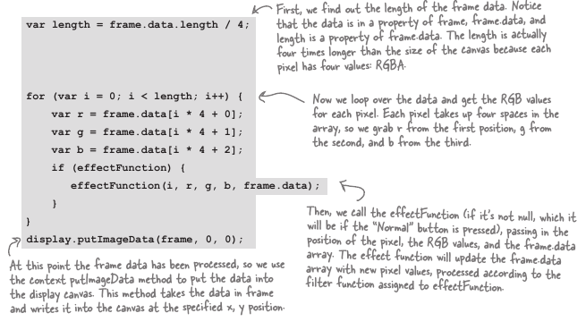

Moje glavno pitanje tokom obrade je bilo kako obraditi sledeci frejm, ili nesto sto se kontinuirano desava, odgovor je 'recursion' like ponasanje, bar mi lici na recursion. U sustini je hack, jer nema standarizirano rijesenje za ovo. 

`setTimeout(funkcijaKojaObradjujeFrejm,0);`

Ovaj expression kaze browseru da zove ovu funkciju cim prije moze, cim se oslobodi slot u queue.

Kad funkcija zove samu sebe unutar svoje funkcije se naziva recursion. Fuck it, look like it. Ovo je u sustini kao rafalna pucnjava, shoot to kill, za sada neme nacina da zovnemo funkciju na svaki frejm. Stupid really!.

## EVENT timeupdate i problem sa nepreciznoscu
On samo obavjesti gdje je vreme iz currentTime promjenjen
Ovo je event koji je sledeca najbolja stvar kojojom mozemo koristiti da odradimo 'update' vremena videa koji se pusta, ali nedovoljnom brzinom da bi mogli precesuirati frejm. Ovaj event mozemo koristiti za recimo seek funkciju.

`setTimout` je za sada jedini nacin sa kojim mozemo dovoljnom brzinom obraditi frejmove.

Mogle bi se odraditi kalkulacije za optimiziaciju, ali i dalje benefiti nisu naj sjajniji dok se ne dobije update API-a.

### Write some Effects(black and white)
ovo je funkcija koja se zove 1 za svaki pixel.
Manje vise nisam bas super zainteresiran za ovo
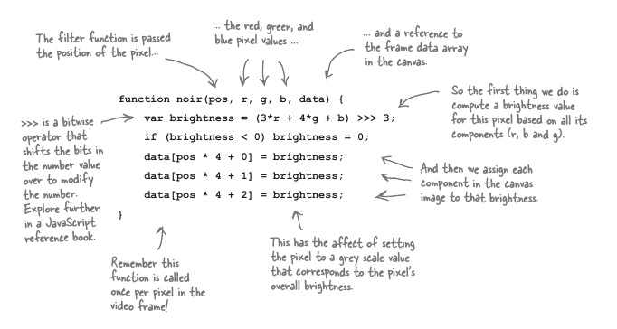

## Streaming?

Ovo sto smo mi radili se zove 'progresive video' streming video koristi drugi protokol, za sada smo mi koristili HTTP protokol isto kao da pokusamo skinuti neki fajl ili webpage.

Streaming ima nekih dodatnih poboljsanja kao sto su:
* Daje korisnicima bolje iskustvo u koriscenju
* efikasniji po pitanju koriscenja korisnikove konekcije(brzine) i smanjuje server bandwidth.
* security mnogo sireg dijapazama.

Odgovor je NE, nema standarda za Streaming video u HTML5, to ne znaci da se to ne moze implementirati, uglavnom znaci da decki iz open sourca ne rade na tome zbog nekoliko razlika, izmedju ostalog DRM i cinjenice da se sa streming video-m moze zaradjivati lova i tako to :).

Iako neka desavanja se vec desavaju i na polju http streaminga, nove informacije su potrebne, resarch baby.

## Errors 
Dealing with errors je relativno lako jer video objekt ima podrsku za isti 

`video.error tacnije video.error.code`

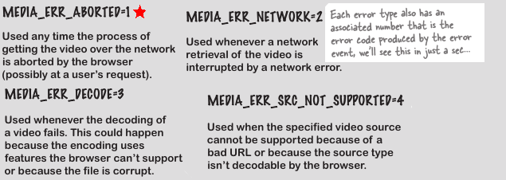

### How to use Error Event

video.error.code vjerovatno mi daje jedan od 1-4 broj natrag.

I to je to handleru mozes zaljepiti poster preko display-a, fuck you its error.

### Error Handler
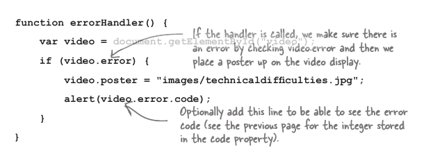

### Dodatne Ideje?
* Napravi content koji se prikazuje u odredjenom vremenskom rasponu.
* Koristi web-servise da pruzis context-relevent informacije za video
    * Recimo definicije poput onih kad sam gledao interview sa Filmskim Direktorima
* Koristi jsonp napravi interaktivni video.
* Napravi watermark
* koristi geolokaciju za dostavljanje reklama
* Napravi video kontrole 
* koristi sve tekstualne APIs iz kanvasa.
### BANG (obrati paznju)
#####BANG: Google Chrome Security issues:
file:// vs http://
Google Chrome moze praviti probleme ako se fajl pusta lokalno.

#####BANG: Safari i mp4
Da bi pustio mp4 u safariju mozda ce ti trebati da instaliras quicktime.

#####BANG: Server i ispravan MIME Type
za apache server dodaj u httpd.conf file sledece:
AddType video/ogg   .ogv
AddType video/mp4   .mp4
AddType video/webm  .webm

U principu govori koja ekstenzija ima koji MIME tip

