Canvas je html5 element koji sluzi sa crtanje pixela na njemu koristeci **_iskljucivo javascript_**.

### Defaultno ponasanje:

Velicina `<canvas>` elementa je ***300px x 150px***, i ako se podesava u CSS-u rezolucija ostaje ista samo se povecava velicina, broj pixela se razvuce. Obicno se definise velicina unutar html elementa

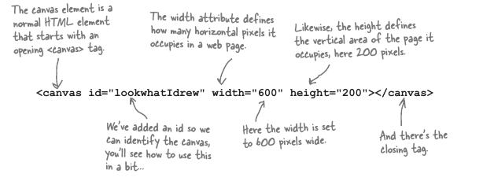

### Osnovne Metode:

Za pocetak crtanja na kanvasu, mora se pratiti protokol:

1.  Definistati `<canvas>` u html
2.  Uhvatiti referencu na taj element sa javascriptom iz DOM-a 
3.  Definisati context sa `getContext('2d')` metodom

### fillRect and strokeRect method
 Vrlo slicne metode ali cine malkice drugaciju stvar. Jedna boji cjelu povrsinu druga, samo border.
 Odlicna ilustracija ispod:

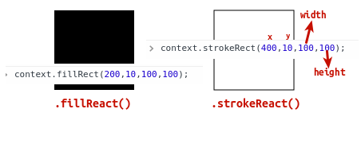


### fillStyle Property
Je property od **context** objekta koji sluzi za podesavanje boje bilo cega sto se nalazi na canvasu. Sve dok se ta boja opet ne promjeni sa istim property-em.

Mozes misliti o njemu na ovaj nacin: "sve sto uradis od sada ce biti ove boje", sve ukljucujuci tekst, krugove, kvadratice, ili druge kompleksnije oblike.

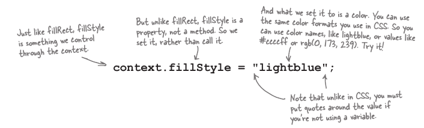


### Cleaning the Canvas

Ovo ima veze sa fillStyle propertiem pa cu ga ukljuciti ovdje:

Jednostavno, treba obojiti cjeli kanvas sa bojom koja je boja pozadine, i nacrtati veliki kvadrat velicine kanvasa preko.

Ovako bi izgledao kod:

``context.fillStyle = 'white'``
``context.fillRect(0,0,canvas.width,canvas.height);``

I to je to, pocinjemo na koordinatama 0,0 (gornji ljevi ugao), i nacrtamo kvadrat velicine kanvasa. BOOM == DONE!.


### Path and Arc
Path(putanja) je kao kad nacrtamo grafitnom olovkom prije nego sto obojimo stalnim markerom, on nam 'pomaze' da definisemo oblik. Nakon toga, zapljusnemo bojom `.stroke()` ili `.fill()` To su dvije metode prilikom crtanja sa pathom koje solidificiraju oblik, i prikazuju ga na kanvasu, za sve vjeke vjekova. Ili dok ne ne nestane struje.

#### Metode Path-a (crtanje Trougla)

***`context.beginPath();`***

Sa njom Otvaramo i kazemo "Ok, pocinem path - Svi MIRNO!" Nista se ne desava ili vidi.

##### context.moveTo(x,y);
Sluzi za pomjeranje virtuelne olovke na mjesto od kuda da pocne obiljezavati path..

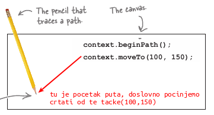

##### context.lineTo(x,y);

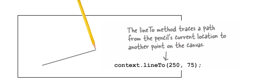
 
Gdje prvo 'povlacenje' zavrsava, drugo pocinje tacno iz te tacke.
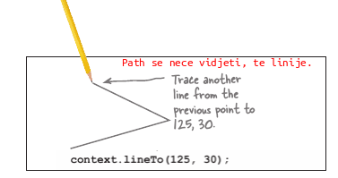

##### context.closePath();
closePath metoda konektuje pocetnu poziciju puta, sa zadnjom pozicijom trenutnog puta.

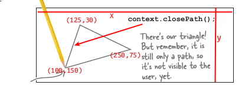

I dalje je sve nevidljivo.

##### context.stroke() && context.fill();
Da bi 'stvorili' trougao ili taj neki bilo koji oblik, moramo ga obojiti. 

Metode su i dalje slicne, jedna boji borders druga sve. I to izgleda ovako.

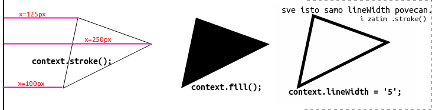

### Crtanje Kruga
Bitno: Kod kruga je vazno shvatiti gdje pocinje i zavrsava ugao. Ako koristimo smjer 'true' to je suprotno od kazaljke na satu. 

Pocetni ugao se racuna iduci suprotno od kazaljke na satu iduci od x ose na desnoj strani.
Zavrsni ugao se racuna iduci u smjeru kazaljke na satu od x ose na desnoj strani.

I ovdje nastaje konfuzija. 


### Arc (ili luk)
Poenta metode `.arc()` definisanje luka koji nam treba za tu svrhu koju zelimo postici. Ako koristimo puni luk, dobijemo krug, ali luk moze biti kakav god nama je potreban.

*Sintaxa izgleda ovako*:
*   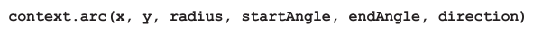

##### Koordinate(x,y) i Radius(poluprecnik)
Bitno je primjetiti da su koordinate x,y od centra kruga ne od njegovih granica.

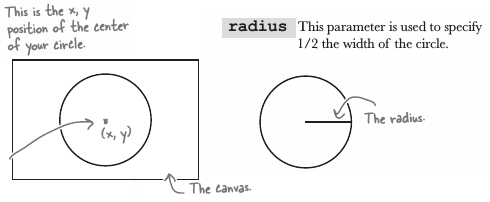

##### startAgle, endAngle i Directions
Ovdje je malo tricky. Direkcije su povezane sa pocetnim i krajnim uglom. Ako stavimo `true` idemo u suprotnom smjeru kazaljke na satu, i pravimo tako reci luk prem gore kao dugu, ili u smjeru duge. 

Ako idemo sa false, to je u smjeru kazaljke na satu i pravimo luk kao osmjeh. 

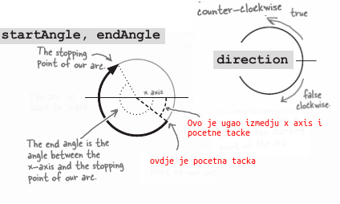
Idemo proci kroz svaku od njih da malo pojasnimo sta je sta, ili gdje!

##### Negativni Uglovi:

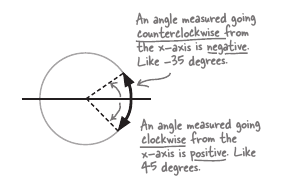

##### Primjer kruga
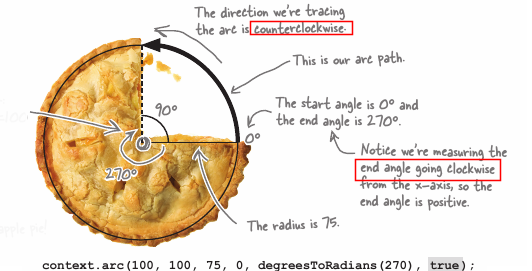
### Koristiti radian u arc metodi
Ok canvas 'misli' u radianima 1 radian je 180/PI(3,14)

*   1 radians = 180 / Pi(3,1415)
*   360 degrees = 2Pi radians
 
Nama je lakse(bar nekim od nas) da misle u stepenima, za tu koverziju nam treba helper funkcija.

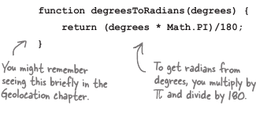


### Krug
Ovako izgleda krug na kanvasu
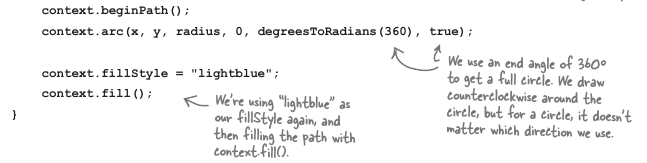

### 'Crtanje Teksta' na kanvasu
Gle, ovo postavljanje na canvas uglavnom prati istu premisu, stvori nesto, promdraj ga 'amo-tamo' sa metodama i priljepi ga na kanvas koristeci x,y koordinate, doslovno bi tako opisao canvas.


##### textAlign - Poravnavanje Teksta
Ovaj dio podesavanja tekst u canvasu je takodjer slican kao i css. Mogu biti
    * Left
    * Center
    * Right

##### fillText and strokeText
Vrlo slicno kao i metode crtanja objekata. Stroke je za okruzivanje, fill je za, pa ... filovanje!
Priljepljivanje teksta je isto sa koordinatama, i dodatnom opcionom opcijom definisanja sirine.

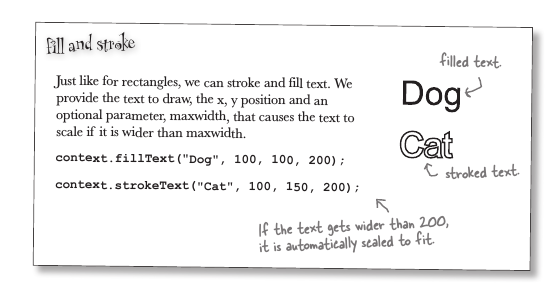

##### context.font
Ovako ide recept: fontSize, fontWeight, fontFamily
Indenticno kao i u Css-u

Kad se sve podesi za ljepljenje izgleda ovako:

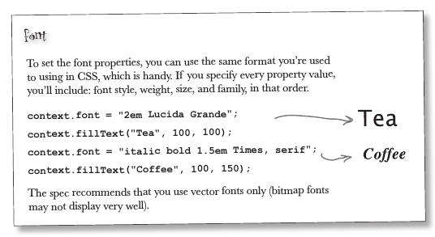
##### textBaseline 

U principu to je podvlacenje crte ispod teksta.

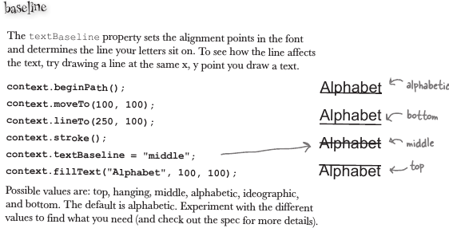


### Crtanje Slike
Ovo je malo kontraintuitivno nego koristiti ```` tag, na kanvasu lakse kontrolisemo ``new Image()`` format nego img.

Vazno je zapamtiti da slika koju hocemo da ubacimo, mora postojati u direktoriju negdje na serveru.

prvo se stvori nova slika sa Image konstruktorom

Image je objekat koji prvo pripremimo i onda tek postavimo na canvas. 

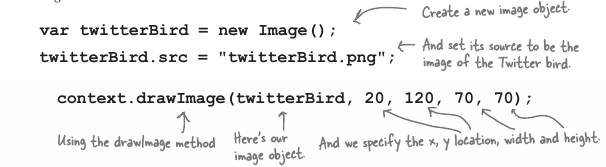


Problem takodjer nastajer jer nekad se slike ne ucitaju odma, zavisno od browsera, brzine interneta. Moramo korisiti onload event da izbjegnemo onu ruznu ikonicu.
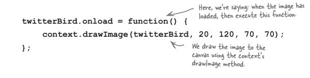
### Komplicirano:

Ovo je vazno za shvatiti, canvas je cool i sve, ali bilo koji oblik koji je malo zahtjevniji(nije krug/kocka/i sl) je izuzetno kompleksan za napraviti ako se radi u cistoj javascripti, ne sumnjam da postoje neke 'code libary' ili framworks koji ce pomoci sa ovim. Drugim rijecima bila bi ludost crtati nesto super kompleksno u canvasu koristeci cisti js.

### 20 kvadratica

Jer podesavamo x i y i sirinu sve random, moze se desiti da kordinate budu na tacnoj granici, ili da kvadratici budu jedan iznad drugog, ili manji koji zaklanja veci, i sl. Ovo naravno moze biti promjenjeno, ali sobzirom na random za sada je tako.

### Ostalo:

#### Novi DOM method selectedIndex

to je property koji vrati broj selektovane opcije od strane korisnika u obliku broja, koji je Array index.
Mozes da pristupis svim opcijama kao array-u.

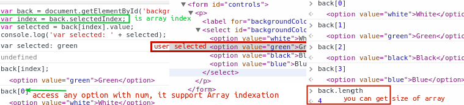

##### Look for help:
Ostale druge stvari koje mozemo uraditi sa `<canvas>` kao naprimjer postavljanje sjenki na elemente i text mozes vidjeti.
[w3.org/2dcontext](http://www.dev.w3.org/html5/2dcontext/)

Text: Imaj na umu da ti crtas po kanvasu, i recimo ako pokusas staviti html text na kanvas kao &amp itd, on nece biti transformisan u html, nego nacrtan u raw obliku.


#### Questions:

1.  How do we create canvas?
    * Tako sto pratimo malu proceduru: Uzmemo referencu od canvasa, i definisemo kontekst.
    
    ```var canvas = document.getElementById('canvasid');```<br>
    ```var context = canvas.getContext('2d');```
    
3.  Zasto ne Flash ili spec app umjesto canvasa?
    * Flash je sjeban svakako, a specijalna app je uglavnom skupa html5 je skup tehnologija radije nego samo markup.
    
2.  Kako pripremimo kanvas za crtanje?
    * Definisemo mu kontekst sa getContext metodom.
3.  Koja je standardna velicina (sirina i visina) canvasa
    * ako nije definisana u html-u ili css-u 300x150px
4.  Zasto ne podesavamo velicinu sa Css-om
    * Jer css u ovome slucaju samo 'razvuce' 300 x 150 px tako sto poveca pixel, a ne broj pixela. Lowresolution.
6.  Sta je canvas?
    * kanvas je u sustini prostor na kojem mozemo da pravimo bitmap oblike sa javaskriptom.
7.  Da li je kanvas providan?
    * Kanvas je providan po defaultu.
7.  Kako 'pristupamo' kanvasu:
    * uzmemo referencu sa javascriptom, zanim definisemo konteksti i pisemo po njemu.
8.  Koju metodu koristimo da obojimo kvadrat.
    * canvas.fillRect();
9.  Kako kanvas zna da je kvadrat crn?
    * fillStyle property u canvas objectu po defaulutu je crn.
10. Kako da promjenimo boju za obojiti(fillovati) kvadrat/krug.
    *   Definisemo novu boju u fillStyle propertisu
11. Sta ako hocu da imam samo border oko kvadrata/kruga?
    *   treba stvoriti oblik sa drugom metodom, strokeRect()
12. Kako da promjenimo boju bordera oko kvdrata/kruga
    * isto kao i za drugo fillRect, sa propertisem fillStyle.
13. Zasto koristimo znake navoda kad koristimo css propertise.
    * Jer Javascript compiler ne bi znao rastaviti css od varijabila.
14. Sta je arc
    * Sta je tacno ne znam, ali sa njim crtamo krugove
15. Sta je path
    * Path je nevidlji 'put' kojim prvo naglasimo kako definisati putanju, te onda je filujemo, ili strokujemo.
16. Kako nacrtati krug?
    * prvo se mora zapoceti "put" beginPath() metoda
    * koristi se .arc metoda sa sledecim arg(x,y,radious,starAngle,stopAngle,directio);
        *   Direction je u kojem smjeru ide arc
        *   stopAngle se izrazava u radianima, 1 radian = Pi = 180stepeni.
        *   Radius je pola duzine kruga
        *   x je horizontalna linija
        *   y je vertikalna linija
17. Kako nacrtati trougao?
    *   Preko 'patha' i jos nekoliko skupine metoda, ali prvo otvoriti put sa metodoto ***beginPath()***
    *   Prvo otvoriti path za taj trougao ``context.beginPath()`` zatim naznaciti gdje pocinje prva linija(starting point) metodom ``moveTo(100,150)`` - To je pocetna pozicija i jos uvjek je samo path, ne vidis se nista.
    *   Nakon toga sledeca metoda koja prati path ``lineTo(250,75)``, i onda kako hocemo mozemo gdje god recimo 
    ``lineTo(125,30)``  i kad smo zavrsili, zatvorimo path sa metodom ``closePath()`` koja poveze linije od objekta kojeg crtamo.
    
    
18. Kako koristimo beginPath metodu.
    *   To je metoda koja se koristi prije pocetka koriscenja path-a, da se otvori path. U slucaju kruga(.arc) ili u slucaju trougla ili nekog drugog kompleksnijeg oblika.
    
19. Kako izrazavamo stepene unutar kanvasa?
    * Radiantima 1 Pi = 180stepeni
20. Koliko je 360 stepeni izrazeno u jedinici za kanvas?
    * 2 PI ili 2 x Pi.
21. Koja metoda za crtanje texta unutar `canvas`
    * Ne znam ovo
22. Kad crtas text u kanvasu koje jos properties moras definisati. 
23. Sta se desava kad podesis context.property
24. Kako dodati sliku u kanvas?
25. Sta se desi kad stavis text ovako `<canvas>You see me? Do you?</canvas>`
    * tekst se nece vidjeti pod uslovom da browser podrzava element, u ovom slucaju canvas.
1.  Sta je context u `<canvas>`
    * Dio po kojem crtamo, jedini upotrebiljivi dio.
28. Zasto ne crtamo direktno na kanvasu, nego u kontextu?
    * Jer ima vise konteksta, kanvas je samo apstraktni oblik koji podrzava vise nacina crtanja.
29. Zasto nam se ne prikazuje svaki put 20 kvadratica?
    * Vise razloga, uglavnom zbog kvadratic moze biti 1px i ispod nekog veceg kvadrata, manji /veci problem,
    * moze biti 0px, moze biti uz samu liniju velicine 1px itd.
