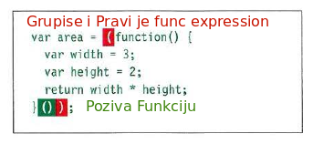

## Function's:

Small functions are better then long methods(functions) - modulation. 

Functions are parameterized blocks of JavaScript code that we can invoke

Nema niakave pompe. Dvije razlike izmedju Func Declaration and Func Expression:
1. Func Declaration je statment zbog unutrasnjeg dodjeljivanja var koje je automatski
2. Func Declaration koristi hoisting, dostupna je od svuda i compiler je deklarise na prvom passu.
3. Func Expression se deklarise prilikom runtime kao i ostatk code.
        
Pocni misliti o funkcijama kao vrijednostima kao sto su brojevi, stringovi, booliani i objekti. Razlika je u tome sto funkciju mozemo "pozvati" invoke it.

A **function reference** is exactly what it sounds like:

a reference that refers to a function. You can use a function reference to invoke a function or, as you’ll see, you can assign them to variables, store them in objects, and pass them to or return them from functions
(just like object references).

#### Several Type of Functions:
* Function Declaration
* Function expression
* Anonimus Function

##### Function Declaration
When the compiler finds one, it creates a function and assigns the resulting reference to a variable with the same name as the function.

A function declaration doesn’t return a reference to a function; rather it creates
a variable with the name of the function and assigns the new function to it
        * You can call it from anywhere, assuming scope.
        * It gets declared in the first pass of compiler

##### Function Expression
* Gets declared at runtime with the rest of the code:
* It result to function reference (**!important**)
* You can pass it around like argument to function, assign it to variable or return it from function:
    * Kao i func declaration, tako da je ovo malo misleeding.
        
* `var loveFunction = function() { `
    `alert("i love you! Do you love me back?")}`

##### Anon Function

Very similar to our friend function expression, ontly with no name, like a ninja - Its deadly. 
* Be more expresive with it.
* less Verbose! *who need shit load of code anyway*!
* Use them wisely, Luke!
    * Can make your code more clear and concise, but you can fuck it up overusing them
    Like nutela, its grate when you eat just a enough of it, but when you start binging you feel like shit afterwards.
    
* 

### Function Reference wtf?

"Function reference" je upravo to, upucivanje na funkciju. Mozes koristiti upucivanje na referencu da pozoves funkciju

`var funHoHo = function() {console.log('Fuck it');}`

`funHoHo();`

Assign then to variable:
`var nod = funHoHo;`

store them in object:

`var obj = { fu: funHoHo }`
Vazno ti je da shvatis kad zoves funkciju, a kad zapravo premeces upucivanje na funkciju.

Ovdje:
`var obj = { fu: funHoHo }` je super primjer jer sam ja u objekt stavio referencu, tako da funHoHo ime vise fakticki ne postoji, jer to treba promatrati kao da je tu ustvari taj kod tu.

## Closure

Closure nastaje kad kombinujemo funkciju koja u sebi ima slobodne variabile *free variables* sa okruzenjem *envirenment* koji pruza svim tim variabilama vrijednosti. 

## Lexical Scope
Means you can determine the scope of variable by reading your code.

## Sta je Hoisting?

Javascript engine radi prvi pass(mozemo to nazvati priprema) prolazeci kroz **function declaration hoisting**, process gdje JS engine radi prvi pass(skenira) kroz kod i "hoistuje" func declaration na vrh execution konteksta zajdno sa globalnim varijabilama, bez obzira gdje se nalaze u kodu, te nam effektivno daje mogucnost 'pozivanja' invokation bilo gdje u kodu, imajuci u vidu scope.

## Execution Context

U JS postoje 3 EC-a:
1. Global Execution Context:
Kod koji je u programu, a nije u funkciji. Ima samo jedan GEC.
2.  Functional Execution Context kod koji se nalazi unutar funkcije, ima ih koliko ima i funkcija.
3.  Eval Functional Execution text koji se pokrece unutar eval() funkcije interno.

## What is Variab1es object:

Svaki od Execution Contexta stvara svoj variable obj, gdje se nalaze detalji o svim variabilama, funkcijama i parametara za taj kontekst.

## Sta je Stack?

Prilikom izvodjenja js radi zanimljivu metodu stakovanja, gdje stavlja na cekanje odredjen statment cekajuci vrijednost od druge funkcije, tako sto onu funkciju od koje ceka vrijednost stavi na prvo mjesto izvodjenja, dok funkciju ili var koja CEKA, stavi na cekanje :).

### Return Vraca 1 ili Vise?

Funkcija nije tu samo da radi i radi, sa njom koristeci keyword "return" mozes vratiti jednu ili vise vrijednosti(array) iz funkcije. Vazno je zapamtiti da momenat kad interpertor naidje na return keyword unutar funkcije on izlazi iz funkcije, i zavrsava izvodjene, tako da svi stejtmenti(ostatak koda) ispod return nece biti odradjen.

## Many types of Functions
1. Function Declaration
2. Function Expression
3. Anonymus Function
4. Immediately invoked Function Expressions(IIFE)
d
### Immediately invoked Function Expressions

Ovo je specijalna vrsta funkcije koja se execute odma kad interpreter naidje na nju. Samopozivna funkcija.

Use them vaisly Luke:
* Koristi ih kad ti treba za kod koji se korisit samo jednom (Event handler/listner)
    * Kao argument kad se zove funkcija(da se izracuna vrijednost za tu funkciju)
    * Za dodjeliti vrijednost propertya u objektu.
    * Za event handler i litner
    * Za prevenciju konflikta izmedju dvije skripte koje bi mogle korisita imena varijabila.
    
    Duckett: 104
    
## Function vs Method

Razlika je u tome sto je funkcija moze stajati sama, nezavisna je.
Metode mora bit dio nekog objekta, dio njegovog 'ponasanja' i zove se sa objekt.method(). Zove se sa tackom 
(memeber operator).

Q:5 Djecaka mnogo razlicitih cine cjelo jedno jelo, neko broji, neko pise neko kaze "nije vise".
A:Primitives.