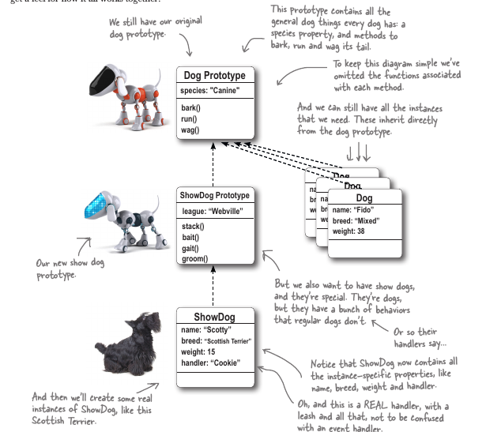

Object is a construct koji u sebi sadrzi stanje i ponasanje, moze se uporediti sa pravim zivotnim objektima, usput kao podsjeca me na malu databazicu koja moze da se samo manipulise. Definise se sa {} ako hoces da "doslovno" (literal) da ga definises. 

U Js je sve objekt, koji imaju svoje metode(anon funkcije), stim da je i funkcija obj koji ima svoje metode i properties.

Svaki Objekt moze imati svoje:
    * Osobine (properties)
    * Metode
    * Evente

### Osobine Objekta (Object Properties)

Osobine objekta naznacuju njegovo stanje, to radi properies odnosno definise u kakvom stanju je neki objekt. Da li je boja, crvena da li nesto radi(true/valse) koliko ima necega i stvari poput toga. Doslovno OSOBINE objekta:


### Objekt Literal
U zavisnosti kako stvaras objek, (literalno ili sa konstruktorom) koristi se drugacija sintaxa, ali poenta je ista, stanje je uglavnom staticno, drzi neku vrijednost, bolean, string, array, num etc. Poziva se bez, zagrada na doticnom objektu. Dok je *ponasanje* (**behaviour**) dinamicno, jelda :) aka method, aka function anonimus function to be more precise.


    //Awesomely demonstirana sintaxa za obj literal.
    var obj = {
    name:   "I'm an object property",
    age:    30,
    aging: function() {
    this.age += 1;
    return 'I just aged for 1 additional year, functions are fun"
    }
    }
     
U sustini objekat je kombinacija name/value gdje je 'name' svojstvo ili osobina(property), a value zapravo vrijednost kao npr anon funkcija.

### Pristupanje Osobinama Objekta

Ovako pristupi vrijednostima iz objekta: **.** ili ['string'] array like.

***Napomena za hrabre!***


#### Mjenjanje i dodavanje novih osobina


```
var obj = {name: "Marko",age:30}//kreiram obj
obj.name => 'Marko' //pristupam prop sa DOT+name
obj["name"] => "Marko"//array like pristupanje

 ``` 
## Mjenjanje osobina Unutar Objekta
Ok ovo me je izjebalo ko' budalu kamen jednom.

Uglavnom moras koristiti funkciju da promjenis stanje neke osobine(property).


## Constructor Function 

Constructor je kao mala tvornicka masina koja moze stvoriti neogranicen broj objekata koji su slicni prema kalupicu koji koristi. Sintaxa je takodjer pomalo frankenstanian, zbog mixa objekt sintaxe i function sintaxe.


Ovako to izgleda, skupa sa stvaranjem instance-a, jer obj constructor dolazi u paketicu sa **NEW** keywordom. Have a look.


## Operator *new*

### Step 1 2 3


### Step 4


### Step 5


## This
This je specijalan keyword koji drzi referencu  na objekt u kojem se nalazi, this je tako univerzalan, nesto kao kameleon uvjek preuzme referencu objekta u kojoj je pozvan. 


Kad pozoves metodu na odredjeni objekt, vrijednost od 'this' je podesena da bude taj objekt cjelo vrijeme dok se metoda procesuira(being evaluated).


## Understanding Object Instances
U js ne mozemo tacno odrediti kojeg je objekt tacno tipa. U js objekti su dinamicni i tip svih obj je Object.

Ono sto mozemo je da saznamo koji ga je constructor napravio 
## instanceof and typeof

Type of moze samo reci kojeg je objekt tipa: String, Boolian, Object, number itd. Ne moze biti mnogo precizas recimo da kaze od koga je napravljan tu izlazi na pozornicu **instanceof**

#### car instanceof Car;

instanceof uporedjuje da li je odredjeni konstruktor stvorio taj instnance, i vrati true/false na osnovu toga.

## Real World constructors

Defaultni Constructori u JS, ima ih mnogo ovo su neki:
new Object();
new Regxp();
Math();
Error();
Array();
Date();


## DOM Element objects

Kad koristis neki od metoda od document objekta. Da dobijest, listu ili u ovome slucaju pojedinacan element objekt kao sto je **p** paragraf. On je isto objekt, element objekt koji ima svoja svojstva(properites) i svoje metode. Zato mozes mjenjati 'live' dom jer pristupis nekom od njegovih objekata i mjenjas mu prop i metode.


* ***InnerHTML*** - Dobijes unutrasnji html u p -(paragrafu), nekad to moze biti samo tekst, a nekad. Ako ima linkova, dobijes i ```<a href="#">link</a>```
* ***firstChild*** - Dobijes prvi child element, koje ce takodjer biti u obliku element objekta.

### Zanimljivo:
Je to da je objekt sastavljen od osobina i vrijednosti, neke od tih osobina su metode :), da metode su isto osobine koje drze 'ponasanje' behaviour. 

### Javascript and Classes

U principu javascript je potpuno object orjentisan jezik, ali ne u klasicnom obliku gdje objekti nasljedjuju od classa, u JS nema class jer objekti nasljedjuju od drugih objekata, to se naziva prototypal inheritance. Prototypal jezici su:

* Fleksibilniji
* Ekspresivniji 
* i Efikasniji
    
cak stovise mozemo implementirati class like inheritance prilikom dizajniranja aplikacija.

### Problem: To much runtime methods

Prilikom dizajniranja objekta moze se desiti da sve nase instance imaju svoju metodu, koja je tipicna za taj objekt, ali ta metoda postoji i u memoriji, sto je prilicno neefikasno zapravo i lose za performance.

Look! Duplikati all over!


### Sta su prototipvo?(prototypes)

Svi nasi objekti nasljedjuju behaviour i state od objekta koji se zove prototip (primjer:**Dog.prototype**), onog momenta kad stvorimo neki konstruktor tada je vec postoji i prototip od kojeg on nasljedjuje po defaultu.

Poenta ovoga je nasljedjivanje i ponovno koriscenje postojecih propertisa, i onda dalje oblikujemo i prosirujemo nas novi objekt.

Dok mi ne postavimo propertie u Prototype u njemu nema bas mnogo, samo par metoda. Drugim rijecima nas posao kao programera je da ih dodamo.

Primjer ilustrovan:


### Kako radi nasljedjivanje:

U sustini odozdo prema gore, presidency ce uvjek biti jace dolje pri dnu(oko naseg objekta).

Ova animacija radi dobro poredjenje:


### Overriding the prototype!

Prilicno jednostavno za objasniti, u koliko nam se ne dopada defaultni property od prototipa, mi ga mozemo override na nacin da prosirimo nas objekt(dodamo na property) sa nazivom metode koja se nalazi u prototipu. U ovom slucaju bark() metoda

;

So where do you get a prototype?
Prototype je definisan onog momenta kad je stvoren novi konstruktor, jer constructor ima prototip od kojeg nasljedjuje a pristupamo mu ovako

* `Dog.prototype`

`prototype` je property od Dog konstuktora.
    

### How to set up the prototype


### How this.name works in prototype back method

Kad se zove objektova metoda, this je podesen na objek koji zove tu metodu, tako da this upucuje bark() na objekt koji ju je pozvao. Ako ta metoda nije pronadjena u tom obj, vec u prot to nije promjenilo vrijednost od this.


## Prototypes are dynamic
U principu ja ovo zovem da je obj ziv. Onog momenta kad prosirimo prototip obj sa dodatnom metodom i property-em istog momenta sve instance toga obj imaju mogucnost pristupanja toj metodi, nasljedjujuci ju.

## Koriscenje prototip i constructor metode skupa
The interesting thing about this code is that when a dog instance starts out life, it inherits
a default value of false for sitting. But, as soon as the sit method is called, the dog
instance adds its own value for sitting, which results in a property being created in the
instance. This overrides the inherited sitting property in the prototype. This gives us a
way to have a default for all dogs, and then to specialize each dog if we need to.

## How sitting works:


Ukratko: Postavimo globalni property u prototype da postavimo defaultno(pocetno) ponasanje za sve instance, takodjer napravimo metodu koja mjenja to globalno stanje u lokalno onda kad se zovne iz odredjene instance, i samim tim i stvara novi loc prop sa promjenjenom vrijednoscu propertia.


 ## hasOwe hasOwnProperty 
 Ako zelimo da provjerimo da li neka instanca ima svoj property mozemo iskoristiti hasOwnProperty metodu
 
 
 
 
 ## More then one Prototype
 
 Recimo da imas prototip pticu, koja moze letiti, pjevati itd, sve sto rade ptice. No medjutim trebas napraviti slican objekt patke, patke su isto ptice one plivaju i imaju jos odredjene druge karakteristike, naravno ne zelimo te karakteristike davati svim pticama.
 
 Ljepota JavaScript je to da mi napraviti prototip patke koji nasljedjuje pticiji prototip i onda prosiriti paciji prototip sa ostalim metodama koje odgovaraju jednoj patki.

U sustini radi ovako: Recimo da trazimo 'fly' metodu, i fly nema u instance duck, idemo korak gore i gledamo duck prototype, ali i dalje nema 'fly' metode, onda idemo i gledamo od kud duck nasljedjuje a to je bird i tu nadjemo nasu 'fly' metodu i boom zovnemo je.

To se zove **prototype chain**

## Prototype Chain(chain of prototypes)
Prototype chaining involves assigning a constructor’s prototype to be an instance of another type.



## Kako nasljedjivanje radi u Prototype chainu

odozdo prema dolje.

Instance -> instancePrototype -> instancePrototypePrototype
Instance ShowDog -> ShowDog Prototype -> Dog Prototype

Metoda putuje od instance koja ima najveci presidency, i trazi tu metodu/property prema vrhu, prema Obj, dok je ne nadje i onda je vrati.
 
 ### Kako da napravimo Prototypa nasljedjuje
 
 U sustini lako, treba nam novi obj cija je funkcija da bude 
    * prazan
    * nasljedjuje od obj koji nama treba
    
obe stvari postizemo kad zovnemo konstruktor bez argumenata
    `aDog = new Dog()`

cjela funkcija ovog objekta je samo njegovo nasljedstvo.

Ovo za nas znaci da prvo stvorimo konstuktor funkciju naseg novog objekta. 'showDog'

napravimo 'konekciju' sa Dog-om da dobijemo nasljedstvo(praznu instance-u) i prosirimo showDog Obj.


### Extending new empty Prototype 'ShowDog'

Ovo treba shvatiti: prototype od ShowDog-a je instance od Dog-a. Znajuci to treba malo prilagoditi okolinu.


Kad kazem okolinu mislim na 'constructor' property koji je nasljedjen od 'Dog' constructora, ovo je jednostavno anomalija koju moramo prepraviti ovako:


## Stvaranje Instanc-e


### Moja Omiljena funkcija .call();

U principu koliko sam shvatio ona iskoristi neku drugu funkciju a vrijednosti postavi u funkciju u kojoj je pozvana. Ako to imas smisla, u ovom slucaju sluzi za DRY code.

ovako to izgleda:


##### Ovako izgleda .call i sta radla :)


### How .call works
Kljuc shvacanja kako .call radi je u tome kako .new radi(new stvori prazan objekt, i podesi this kao referencu na taj obj, taj novi obj) To je tako kad zovemo konstruktor uobicajno.

No medjutim kad ne zovemo new nego .call i predamo mu 'this' koji je vec refernca na postojeci obj, u tome slucaju konstruktor koristi onaj 'this' koji mu je predan i tu podesi vrijednosti 'name,breed,weight'. Sobzirom da new nismo zvali, Dog ne vrati novi obj.


this.handler vrijednost je dodjeljen 'thisu' od strane showDog-a. Ovo je sada lako za shvatiti kad znamo ko je this i kad smo svjesni odsustva 'new'

### Chain ends in Object.

What is object you may ask. Well, objek je nesto kao pri-ordal objekt. Objekt od koga svi objeksti nasljedjuju, doslovno svi. Objekt takodjer sadrzi svoje osobine(property) od kojih si vec koristio neke
* hasOwnProperty()
* toString();


### Overriding built-in behaviour(method)


### Extending built-in behaviour


Ovako to izgleda u testu.

Questions:
1. What is Object-Oriented Anyway?
2. How properties work
3. How many properties can an object have?
4. What happens if I put a comma after the last property?
5. What is refference to an object?:The reference is like a pointer or an address to the
actual object.
6. What you mean object contain state and behaviour?
7. Da li je metoda osobina i vrijednost?
8. Zasto je ime constructora veliko slovo?
9. Interesantan nacin da koristimo obj literal i obje constructor?(args)
10. Za sta je bolji obj literal?
11. Za sta je bolji obj constructor?
12. Sta je constructor?
13. Kad koristimo new?
14. Sta radi new?
15. A sta ako cons ima dosta parametara?
16. Kako da znamo da li je obj stvoren od nekog construktora?
17. Sta je prototypal inheritance: U JS objekti nasljedjuju ponasanje od drugih objekata, to se naziva prototypal inheritance. At the moment there is no classes in JS.
18. Sta znaci da override property u prototipu?
19. Kad napisemo constructor funkciju dobijemo nesto 'uz' nju, sta je to nesto?
20. Zasto se objekt smatra dinamicnim?(zivim)
21. Sta je Object(ne object);
22. Sta to Object ima sto svi isto mogu imati(nasljede);
